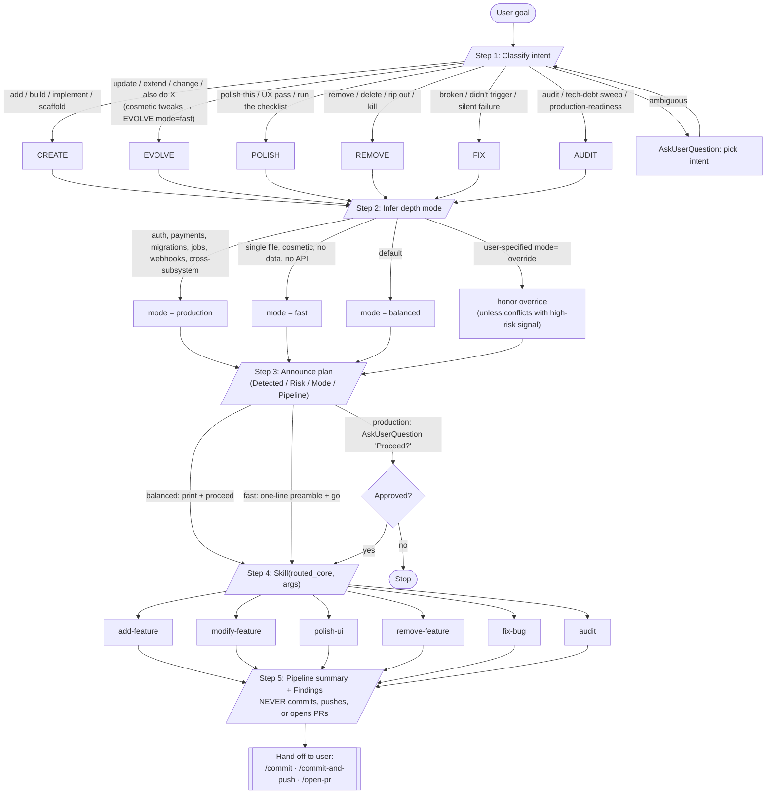
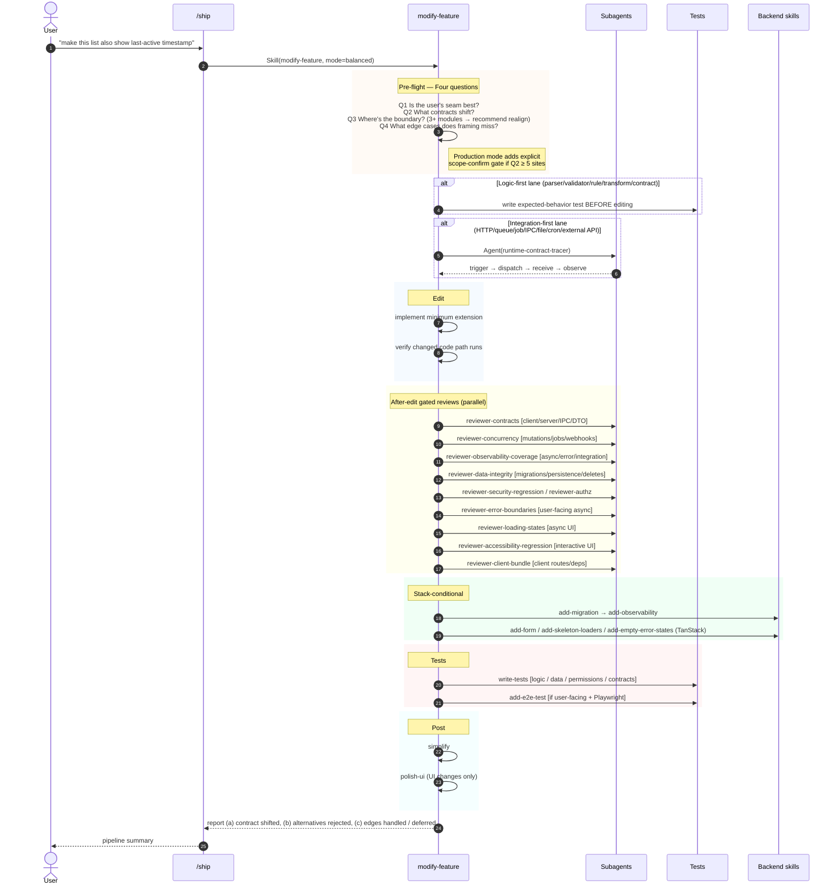
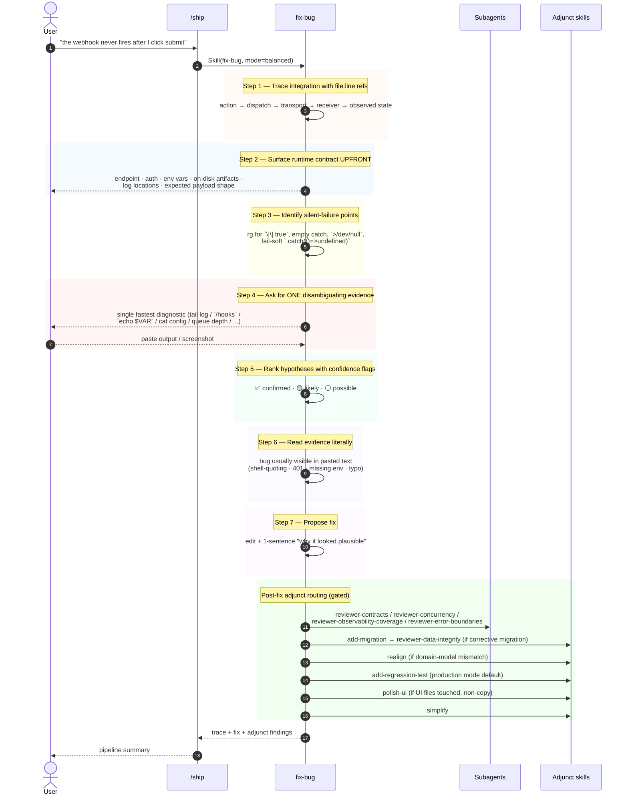
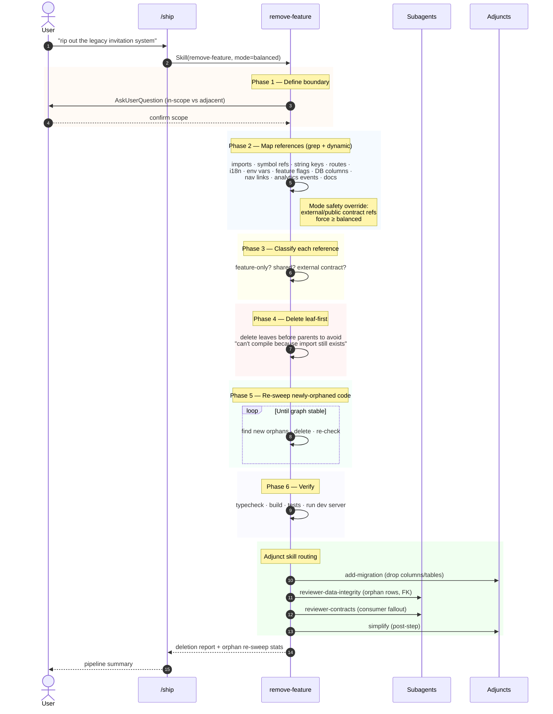
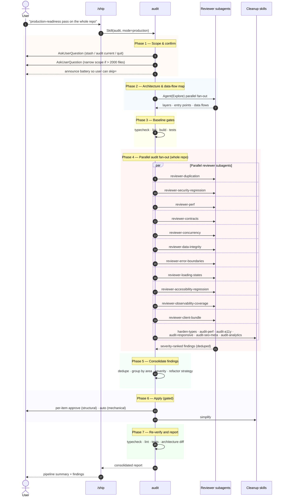
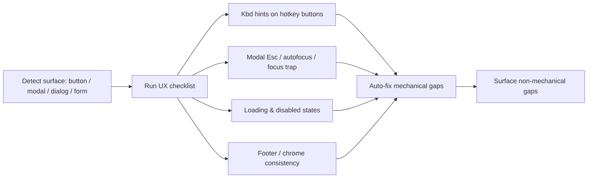
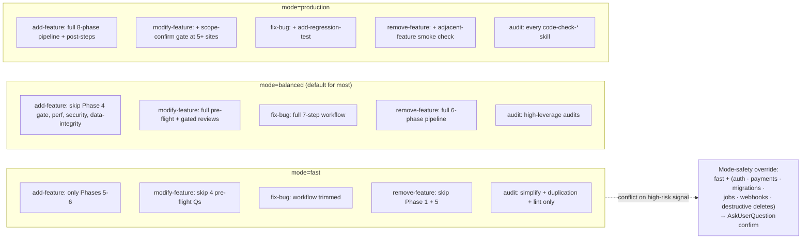

# `/ship` — Diagrams for Teaching

A visual companion to `core/plugins/agentsystem-core/skills/ship/SKILL.md` and the routed core skills it hands off to. Use these to walk through how `/ship` classifies a request, picks a depth mode, and delegates to the matching core skill — and how each routed skill spawns its sub-skills and reviewer subagents.

> Source files referenced:
> - `core/plugins/agentsystem-core/skills/ship/SKILL.md`
> - `core/plugins/agentsystem-core/skills/{add-feature,modify-feature,remove-feature,fix-bug,audit,polish-ui}/SKILL.md`
> - `core/plugins/agentsystem-core/agents/*.md`

---

## 1. `/ship` orchestrator — top-level routing

`/ship` is a router. It (1) classifies intent, (2) infers a depth mode, (3) announces the plan, (4) delegates to **one** core skill, (5) reports — and stops before git.



**Teaching points**

- Intent table is the contract — when in doubt, ship asks **one** disambiguating `AskUserQuestion`, never guesses.
- Mode is announced in every run, even `fast`. "It just worked" is indistinguishable from "it did the wrong thing silently" — visibility is the differentiator.
- One core skill per `/ship` run. Multi-intent prompts (`add X and remove Y`) are run as **sequential** `/ship` invocations.
- `/ship` never commits — Step 5 always hands off to a separate publish skill.
- Cosmetic single-element tweaks route to EVOLVE with `mode=fast` (via `modify-feature`), not a dedicated tweak intent.

---

## 2. CREATE → `add-feature` (production mode, full pipeline)

The richest pipeline. Eight phases plus post-steps. Reviews and adjuncts are **gated** — only the ones whose gates the diff trips actually fire.

```mermaid
sequenceDiagram
    autonumber
    actor U as User
    participant Ship as /ship
    participant AF as add-feature
    participant Sub as Subagents
    participant Stack as Stack adjuncts
    participant Tests as Test skills

    U->>Ship: "add stripe webhook handler"
    Ship->>Ship: classify=CREATE, mode=production, announce
    Ship->>AF: Skill(add-feature, mode=production)

    rect rgb(245,245,255)
    Note over AF: Phase 1 — Clarify
    AF->>U: AskUserQuestion (scope, UX, data, API,<br/>integration, CRUD surfaces, edges, non-goals, done)
    AF->>Sub: Agent(crud-surface-mapper)
    Sub-->>AF: surface inventory w/ file:line
    U-->>AF: confirm restated goal
    end

    rect rgb(245,255,245)
    Note over AF: Phase 2 — Explore
    AF->>Sub: Agent(ui-pattern-inspector) [if recurring UI]
    AF->>Sub: Agent(utility-finder) [per helper]
    AF->>Sub: Agent(Explore) [parallel fan-out if wide]
    Sub-->>AF: reuse / extend / write-new verdicts
    Note right of AF: Realignment boundary check —<br/>route to realign if rename
    end

    rect rgb(255,255,240)
    Note over AF: Phase 3 — Design
    AF->>AF: persistence decision · data · API · structure ·<br/>reuse · UI parity · tests · rollout · risks
    AF->>Sub: Agent(runtime-contract-tracer) [integration-first lane]
    end

    rect rgb(255,245,245)
    Note over AF: Phase 4 — Plan-Approval Gate (MANDATORY)
    AF->>U: ExitPlanMode / present plan
    U-->>AF: approve / revise / quit
    end

    rect rgb(240,250,255)
    Note over AF: Phase 5 — Implement
    AF->>AF: data → server → API → UI → wiring
    AF->>Sub: Agent(parallel) [only if independent]
    end

    rect rgb(250,250,250)
    Note over AF: Phase 6 — Verify
    AF->>AF: typecheck · lint · build · execute new code path
    end

    rect rgb(255,250,240)
    Note over AF: Phase 7 — Gated Reviews (parallel fan-out)
    AF->>Sub: reviewer-duplication (always)
    AF->>Sub: reviewer-security-regression / reviewer-authz
    AF->>Sub: reviewer-perf
    AF->>Sub: reviewer-contracts
    AF->>Sub: reviewer-concurrency
    AF->>Sub: reviewer-observability-coverage
    AF->>Sub: reviewer-data-integrity
    AF->>Sub: reviewer-error-boundaries
    AF->>Sub: reviewer-loading-states
    AF->>Sub: reviewer-accessibility-regression
    AF->>Sub: reviewer-client-bundle
    Sub-->>AF: severity-ranked findings
    AF->>AF: apply auto-fixable; surface rest

    AF->>Stack: code-enforce-route-data / code-enforce-layers (TanStack)
    AF->>Stack: add-migration (backend)
    AF->>Stack: add-form / add-skeleton-loaders / add-empty-error-states (UI)
    end

    rect rgb(245,245,255)
    Note over AF: Phase 8 — Tests
    AF->>Tests: write-tests
    AF->>Tests: add-e2e-test [if user-facing flow + Playwright]
    end

    rect rgb(240,255,240)
    Note over AF: Post-steps
    AF->>AF: simplify (always)
    AF->>AF: polish-ui (UI files only)
    end

    AF-->>Ship: pipeline summary + findings
    Ship-->>U: Step 5 report; hand off to git
```

**Teaching points**

- Phase 4 (plan approval) is the **single most important gate** — production mode never bypasses it.
- Reviewers run **read-only** and return severity-ranked findings. The skill applies `auto-fixable: true` items mechanically and **surfaces** the rest — it does not silently fix.
- The four "investigation" subagents (`crud-surface-mapper`, `ui-pattern-inspector`, `utility-finder`, `runtime-contract-tracer`) all run in fresh contexts to keep search noise out of the parent.
- `balanced` mode skips the Plan-approval gate, security/perf/data-integrity reviews unless gates trigger; `fast` mode runs **only** Phase 5 + 6.

---

## 3. EVOLVE → `modify-feature` (balanced mode)

Lighter than `add-feature` (no plan-approval gate), but still maps which contracts shift before editing. Also handles cosmetic single-element changes when invoked with `mode=fast`.



**Teaching points**

- The four pre-flight questions exist because a small extension is the most dangerous size of change — large enough to shift contracts, small enough to skip the thinking.
- Q2 explicitly mandates an **audit order**: types → API → persisted rows → UI states → runtime/lifecycle state → tests → docs → peer consumers → live-update wiring.
- `mode=fast` skips the four pre-flight questions and the gated reviews — use it for cosmetic single-element changes the user has explicitly scoped.

---

## 4. FIX → `fix-bug` (balanced default; 7-step workflow)

Designed for **silent integration failures** — code that runs without error but the side effect never happens. NOT for crashes with stack traces.



**Teaching points**

- Step 2 is the differentiator — the user shouldn't need to ask "what endpoint?" or "what env var?". Surface the runtime contract **in the first message**.
- Step 4's "ONE observation that splits hypothesis space in half" is the cost-saver — don't ask the user to run three diagnostics in parallel.
- Step 6 is the most-violated rule in practice: when the user pastes runtime output, the bug is usually verbatim in the output, not in the hypothesis list.

---

## 5. REMOVE → `remove-feature` (balanced default; 6 phases)

Deletion is destructive and asymmetric — a missed reference breaks the build, a missed dead helper rots silently for months. Both are tracked.



**Teaching points**

- Phase 2's hardest case is **string/dynamic** references — i18n keys, `route('feature-name')` lookups, analytics event names, env vars referenced via `process.env[varName]`. Pure grep on the symbol misses these.
- Phase 5 (re-sweep) is the difference between a clean removal and rot. After deleting a feature, helpers it owned become dead too — and the helpers' helpers, recursively.
- `mode=fast` skips Phase 1 (boundary confirm) and Phase 5 (re-sweep). External-contract references **always** force ≥ balanced.

---

## 6. AUDIT → `audit` (whole-codebase tech-debt sweep)

Heavier than `simplify`, slower than any single `code-check-*`. Maps architecture first, then orchestrates the full reviewer battery.



**Teaching points**

- `mode=fast` runs only `simplify` + duplication + typecheck/lint. `balanced` adds the high-leverage audits. `production` runs everything.
- Mechanical fixes auto-apply; structural ones gate per-item.
- The dirty-tree check at Phase 1 prevents tangling WIP with audit findings.

---

## 7. POLISH → `polish-ui`

Intentionally narrow — applies the UX checklist to existing UI without changing behavior. Does not fan out to scaffolding or audits.



**Teaching points**

- POLISH = "apply the checklist, no specific change named". If the user names what to change, route EVOLVE instead (`modify-feature` with `mode=fast` for cosmetic single-element changes).
- `polish-ui` is the only routed core skill that *doesn't* fan out — the work *is* the checklist.

---

## 8. Subagents at a glance

The investigation/review subagents `/ship` skills delegate to. All run in **fresh contexts** — they keep search noise out of the parent skill.

```mermaid
flowchart TB
    subgraph INV["Investigation subagents (gather facts)"]
        I1[crud-surface-mapper<br/>every create/edit surface for an artifact]
        I2[ui-pattern-inspector<br/>sibling conventions for recurring UI]
        I3[utility-finder<br/>existing equivalents before writing new]
        I4[runtime-contract-tracer<br/>trigger → dispatch → receive → observe]
        I5[pr-comment-resolver<br/>address-pr-comments helper]
    end

    subgraph REV["Reviewer subagents (severity-ranked findings)"]
        R1[reviewer-duplication]
        R2[reviewer-security-regression]
        R3[reviewer-authz]
        R4[reviewer-perf]
        R5[reviewer-contracts]
        R6[reviewer-concurrency]
        R7[reviewer-data-integrity]
        R8[reviewer-observability-coverage]
        R9[reviewer-error-boundaries]
        R10[reviewer-loading-states]
        R11[reviewer-accessibility-regression]
        R12[reviewer-client-bundle]
    end

    subgraph CALLERS["Who calls them"]
        AF[add-feature]
        MF[modify-feature]
        FB[fix-bug]
        RF[remove-feature]
        AU[audit]
    end

    AF --> I1
    AF --> I2
    AF --> I3
    AF --> I4
    MF --> I4
    FB --> I4

    AF --> R1 & R2 & R3 & R4 & R5 & R6 & R7 & R8 & R9 & R10 & R11 & R12
    MF --> R5 & R6 & R7 & R8 & R2 & R3 & R9 & R10 & R11 & R12
    FB --> R5 & R6 & R8 & R9
    RF --> R5 & R7
    AU --> R1 & R2 & R4 & R5 & R6 & R7 & R8 & R9 & R10 & R11 & R12
```



**Teaching points**

- Reviewers are **read-only**. They report; the parent skill applies `auto-fixable: true` items mechanically and surfaces structural ones to the user.
- Investigation subagents return **structured inventories**, not advice — the parent skill makes the decision.
- The same subagent (e.g. `runtime-contract-tracer`) is called by `add-feature`, `modify-feature`, and `fix-bug` because the underlying need (trace an integration) is the same.

---

## 9. Mode behavior comparison



**Teaching points**

- Defaults differ by skill: `add-feature` defaults to `production`, `modify-feature`/`fix-bug`/`remove-feature` default to `balanced`, `audit` defaults to `balanced`.
- The mode-safety override is universal — even when the user explicitly types `mode=fast`, high-risk signals force a confirmation prompt instead of silent honor.
